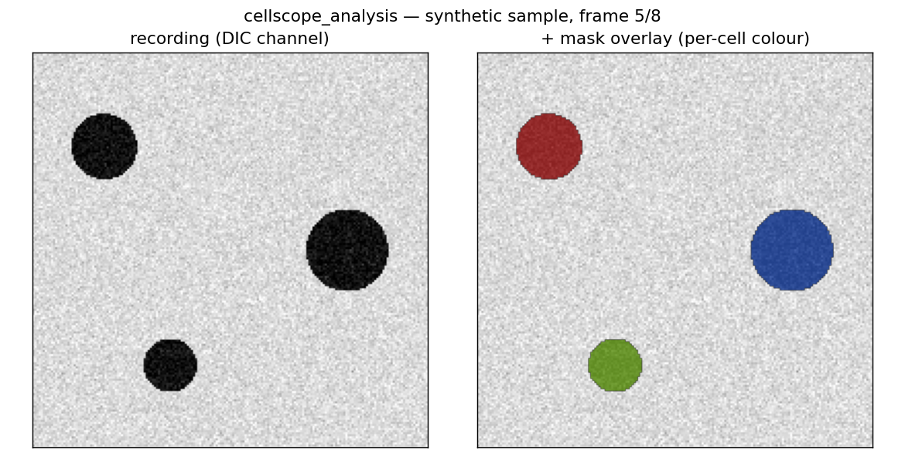

# cellscope_analysis

View and analyse **CellScope detection results** — microscopy recordings
(`.ome.tif`) with their segmentation/tracking masks (`masks.npz`) — in a
lightweight PyQt5 + pyqtgraph GUI, plus a GUI-free analysis package to build
on.

This is a companion to the [CellScope](https://github.com/gddickinson/cellscope)
pipeline: CellScope *produces* the masks; this project *views and analyses*
them. It is intentionally small and modular, meant to grow.



## Environment

**CPU-only — no GPU, no torch/cellpose.** It only views/analyses
pre-computed masks. Create the dedicated env once:

```bash
conda env create -f environment.yml      # python, numpy, tifffile, pyqtgraph, PyQt5, matplotlib, pytest
conda activate cellscope_analysis
```

(The CellScope `cellpose4` env also has these deps if you'd rather reuse it.)

## Quick start

```bash
# 1) (optional) make the bundled synthetic sample so it runs with no setup
python scripts/make_sample_data.py

# 2) launch — discovers recordings from config.json, else the sample
python main_viewer.py

# point at your own results instead:
python main_viewer.py --data-root /path/to/results/by_condition
# or open one recording directly:
python main_viewer.py --recording R.ome.tif --masks R/pipeline_results/masks.npz
```

In the GUI: pick a recording, choose a channel, scrub frames (slider or
**←/→**), toggle **Show masks** / **Outlines only**, set overlay **opacity**.
The status bar shows frame, time, µm/px, cell count, and the cell ID under
the cursor.

## Pointing at your data

Real data is **not** stored in this repo. Copy the template and edit:

```bash
cp config.example.json config.json     # config.json is gitignored
# set "data_roots" to your CellScope results, e.g.
#   ".../cellscope/ic295_analysis/by_condition"
```

Each root is scanned recursively for recording folders (a `*.ome.tif` plus a
`pipeline_results/masks.npz`). The bundled synthetic `sample_data/` is always
available as a fallback.

## Data formats

| | format |
|---|---|
| Recording | `*.ome.tif`, `(T, C, H, W)` uint16 + `*.ome.json` sidecar (`um_per_px`, `time_interval_min`, `channel_names`) |
| Masks | `masks.npz`, key `labels`, `(T, H, W)` int32 — `0`=background, positive IDs are cells consistent across frames |

## Analysis

`maskviewer/analysis/label_stats.py` provides pure NumPy functions over a
label stack — `n_cells_per_frame`, `cell_areas_px`, `track_lengths`,
`centroids`, `summary`. Build further analysis here (see `CLAUDE.md` for
seeds).

## Layout

See **INTERFACE.md** for the full map. `maskviewer/{io,gui,analysis}` +
`main_viewer.py` + `scripts/` + `tests/`.

## Tests

```bash
python -m pytest -q       # in the cellscope_analysis env
```

## License

MIT (see LICENSE).
