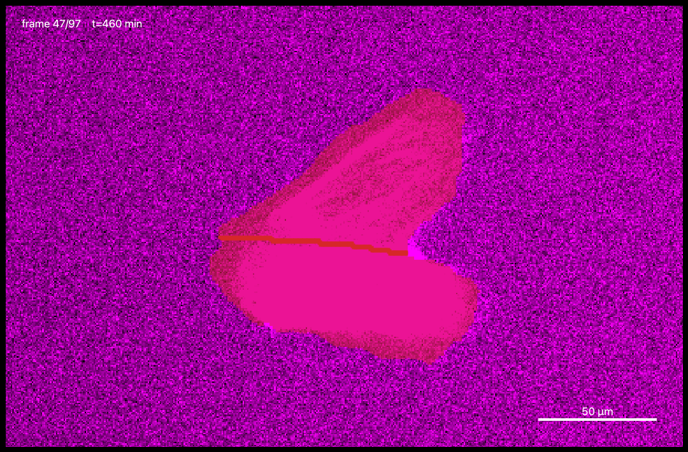
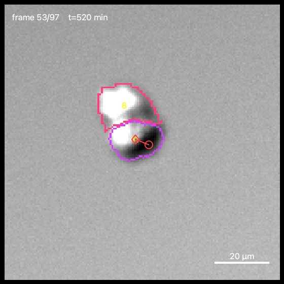
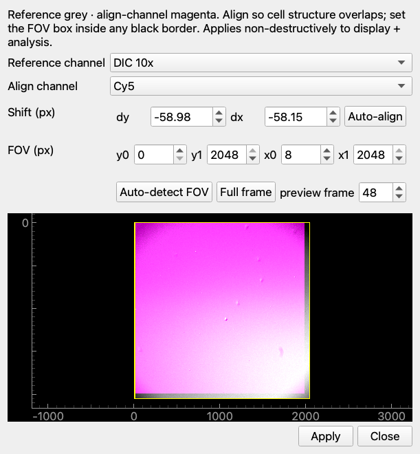
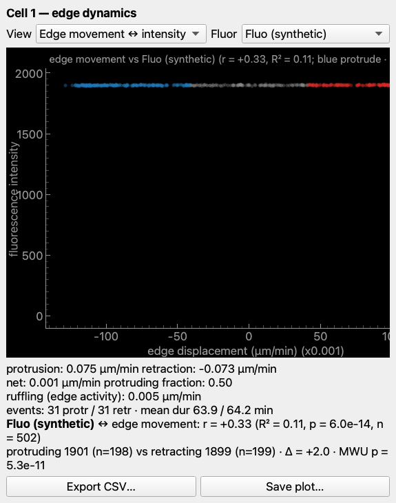
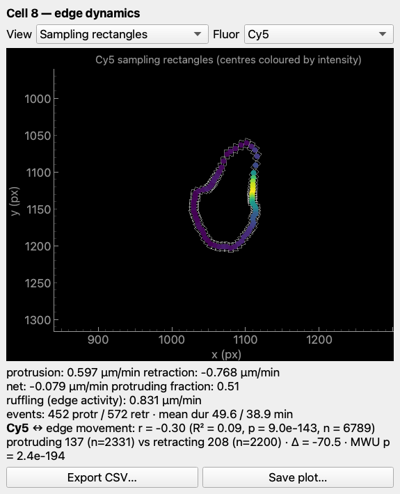
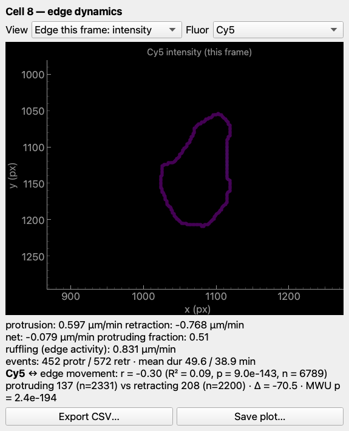
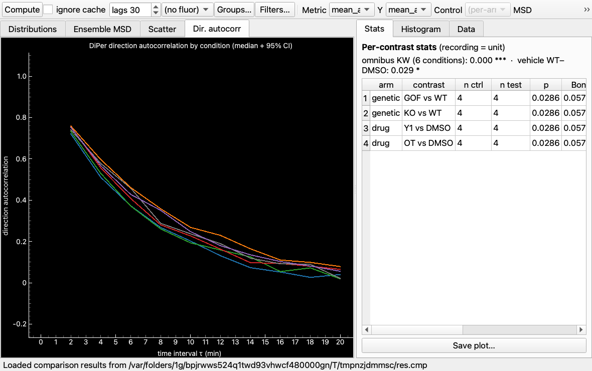
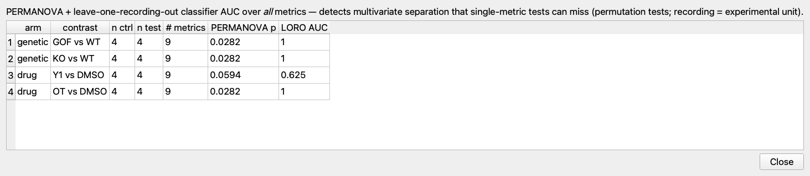
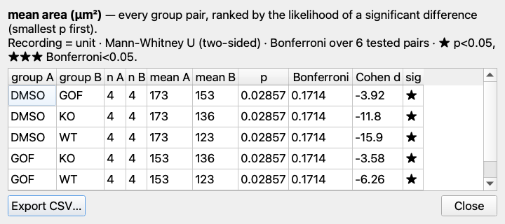
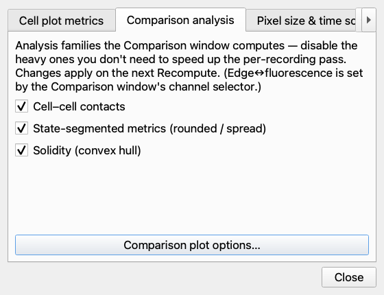

# cellscope_analysis

**A viewer + analysis workbench for [CellScope](https://github.com/gddickinson/cellscope)
detection results.** Open microscopy recordings (`.ome.tif`) with their
segmentation/tracking masks (`masks.npz`), inspect individual tracked cells, quantify
shape / motility / edge dynamics, compare treatments across recordings, and export
everything as tidy CSV.

CellScope *produces and edits* the masks; this is the **bench for analysing them**.
CPU-only (no GPU / torch) — a PyQt5 + pyqtgraph desktop GUI plus a pure, GUI-free
`maskviewer/analysis` package that does the maths. Built for a **PIEZO1**
keratinocyte-migration study, but general to any CellScope recording.


---

## Quick start

```bash
git clone https://github.com/gddickinson/cellscope_analysis.git
cd cellscope_analysis
conda env create -f environment.yml     # once
conda activate cellscope_analysis
python main_viewer.py
```

The viewer opens on a **blank slate**. Load data by any of:

- **File ▸ Open Project Folder** — point at a `by_condition` results tree (it
  auto-derives the experimental design);
- **drag & drop** a folder, a project `.json`, or `.ome.tif` files onto the window;
- **File ▸ Recent Projects**.

No data of your own? Tick **Load demo sample data** in **Config ▸ Settings ▸ Startup**
and relaunch. Installing on a lab PC → see [Running it](#running-it).

---

## What you can do

### View & navigate
- **Dockable workbench** — every panel detaches/resizes; the layout persists. Timeline
  bar (play/pause, fps, loop, ←/→) sits below the image.
- **Full image controls** — histogram + draggable levels, brightness/contrast, gamma,
  colormap, invert, auto — *per channel*; a **composite** multi-channel blend (DIC grey
  + SiR-actin magenta). 1, 2, or any number of channels.
- **Overlays** — masks (show / outline / opacity), scale bar, frame/time, cell IDs,
  track trails, **division links**.
- **Colour cells by any metric** (area, speed, circularity, contact class, shape mode,
  …) with a **units colour bar**. **Zoom to Cell** (`Z`) frames a cell in a sparse field.

### Inspect a cell
- Click a cell → summary + a plot of **any per-frame characteristic** (shape, state,
  speed, displacement, turning, nearest-neighbour, per-channel intensity / membrane), or
  **MSD** (log/linear, α/D + Fürth persistence-time), or **direction autocorrelation**.
- Per-cell results are cached; **Precompute all cells** makes switching instant.

### Edge & membrane dynamics
- Protrusion/retraction, boundary **radius**, and edge **curvature** kymographs + matching
  per-frame edge maps.
- **Edge movement ↔ fluorescence** — correlate local protrusion/retraction with
  **PIEZO1 / SiR-actin / any** channel: a scatter coloured by movement class with
  **r / R² / p** and a sampling-rectangle overlay. A faithful reproduction of the lab's
  `cell_edge_analysis`, adapted to closed tracked cells.

### Cell–cell contact & lineage
- **Contact = shared mask boundary** (not centroid proximity): per-frame contact
  fraction / count / interface length + a **free / point / extensive** class; contact
  episodes over a track; an exportable cell-pair contacts table.
- **Divisions** inferred + scored from the masks — parent→daughter overlay + lineage tree.

### Populations & shapes
- **Population** — all cells at once: time series, mean ± SEM/SD, histogram,
  **flower plot**, lineage timeline; with filtering.
- **Shape modes** — VAMPIRE-style clustering (mode shapes, fractions, entropy).

### Compare treatments — Comparison window (`Ctrl+Shift+C`)
Cross-recording / treatment analysis with **recording = experimental unit**:

- **Distributions** (strip / box + Bonferroni stars / superplot) and **Scatter** (+ Spearman).
- The **DiPer trajectory family** of per-condition curves — **Ensemble MSD**, **Direction
  autocorrelation**, **Directionality ratio** (d/D), **Velocity autocorrelation** —
  **bit-identical to the lab's `diper_clone`** (pinned by tests), each with an optional
  **individual-recording-curve** overlay.
- **Stats** — per-contrast p / Bonferroni / Cohen's d / covariate-adjusted OLS, a
  **Ranked report** of every group pair, and a **multivariate phenotype test**
  (PERMANOVA + leave-one-recording-out AUC) that catches separation single metrics miss.
- **Groups & Comparisons editor** — assign / include / exclude recordings, set controls
  + vehicle; applies instantly (a remap, no recompute).
- **Filters** (frames, track-quality, cells/recording, state, crowding, edge distance);
  every graph is **stylable** (fonts, axes, fits, legend, bins, trendlines…).

### Projects & data management
- **Open any dataset** as a project — auto-derives the design (arms / controls / vehicle
  / colours); save/reopen as a small **project file**; switch via **Recent Projects**.
- **Assemble across cellscope projects** — *Add Folder to Project* / *Open Recording*
  (persisted); **Include / Exclude Recordings** (two-way synced with the comparison).
- **Portable** project files — paths stored relative to the file, so a project moves with
  its data / resolves on any machine or share mount.
- **Drag & drop**; loads **raw multi-position Micro-Manager OME-TIFFs** in place;
  recordings may mix sizes / lengths (e.g. **single-cell crops**).
- **Config ▸ Settings** (`Ctrl+,`) — one tabbed window for cell-plot metrics, comparison
  families, analysis parameters, pixel/time scale, and startup behaviour.

### Export
- **CSV export** (`Ctrl+E`) for Origin/Prism — per-frame / per-cell / tracks / cell-pair
  contacts. Scope the **current recording or all recordings** (one file per recording /
  combined / **per condition**), pick **which per-frame columns** to write, plus a
  **DiPer-ready trajectory** export and ensemble-curve CSVs.
- Save any plot (PNG/SVG), window screenshots, and a **Help ▸ Metrics Reference** that
  documents every metric (tooltips throughout).

---

## Screenshots

**Per-cell panels** (a WT-control recording from the study):

| Cell inspection | Population (flower) | Shape modes |
|---|---|---|
|  |  |  |

| Cell–cell contact | Division links | Channel alignment & FOV |
|---|---|---|
|  |  |  |

**Edge movement ↔ SiR-actin (Cy5)** — the edge-movement vs per-sector intensity scatter
(coloured by movement class) with regression + r/R²/p, the sampling rectangles, and the
boundary coloured by per-sector intensity:

| Edge ↔ intensity | Sampling rectangles | Edge this frame |
|---|---|---|
|  |  |  |

**Cross-treatment comparison** (cross-condition tabs use synthetic data):

| Comparison (box by condition) | Direction autocorrelation (DiPer) | Multivariate phenotype |
|---|---|---|
|  |  |  |

| Ranked report | Groups & Comparisons editor | Settings |
|---|---|---|
|  |  |  |

---

## Running it

```bash
python main_viewer.py                                  # blank slate (or per Config ▸ Startup)
python main_viewer.py --data-root /path/to/by_condition  # open a results tree
python main_viewer.py --recording R.ome.tif --masks R/pipeline_results/masks.npz
python scripts/make_sample_data.py                     # (re)create the synthetic sample
```

**Headless / automated** — drive the GUI over a localhost HTTP API (for tests, agents,
screenshots):

```bash
MASKVIEWER_REMOTE=8765 python main_viewer.py
curl 'http://127.0.0.1:8765/set?recording=0&frame=5&color_by=area'
curl 'http://127.0.0.1:8765/screenshot?path=/tmp/v.png&what=window'
```

GUI changes can also be verified with `QT_QPA_PLATFORM=offscreen`.

---

## Pointing at your data

Real data is **not** stored in this repo. The quickest way in is **File ▸ Open Project
Folder**; save it as a `.json` project to reopen later. For a default launch set, copy
the config template and edit, then enable **Load data from config.json** in
**Config ▸ Settings ▸ Startup**:

```bash
cp config.example.json config.json     # gitignored
# "data_roots": [".../cellscope/ic295_analysis/by_condition"]
```

Each root is scanned for recording folders (`*.ome.tif` + `pipeline_results/masks.npz`);
the immediate sub-folder name becomes the **condition**. The bundled synthetic
`sample_data/` is the opt-in demo fallback.

---

## Data formats

| | format |
|---|---|
| Recording | `*.ome.tif`, `(T, C, H, W)` uint16 + `*.ome.json` (`um_per_px`, `time_interval_min`, `channel_names`) |
| Masks | `masks.npz`, key `labels`, `(T, H, W)` int32 — `0` = background, positive IDs track-consistent |

The **mask label stack is the single analysis input** — every metric (shape, motion,
edge, state, **lineage / divisions**) is computed from it *in this project*. Pre-cleaning
pipeline artifacts (e.g. `divisions.json`) are not read, so IDs/edits made before the
masks were finalised never leak into a result.

**What the data is + how masks were made** — see [`docs/DATA.md`](docs/DATA.md).

---

## Programmatic use

The GUI-free `maskviewer/analysis` package does everything the GUI does — usable from
scripts and notebooks:

```python
from maskviewer import project as projmod
from maskviewer.analysis import compare, exporters

proj = projmod.load_project(".../ic293.json")          # or from_data_roots(folder)

# per-cell table + the four DiPer ensemble-curve tables (recording = unit)
per_cell, msd, autocorr, dir_ratio, velcorr = compare.build_comparison(proj.entries)
per_rec  = compare.aggregate(per_cell)
mv       = compare.multivariate_contrasts(per_rec, arms=proj.design.arms)  # PERMANOVA + AUC

# DiPer-ready trajectory CSVs (one file per condition = one DiPer group)
exporters.export_diper(proj.entries, out_dir="diper_out", group="condition")
```

Modules: morphometry (`cell_metrics`), motion (`motion` — incl. the DiPer direction
autocorrelation / MSD / directionality ratio / velocity autocorrelation, all matched to
`diper_clone`), state (`state`), nearest-neighbour (`neighbors`), edge dynamics
(`edge_dynamics`), edge↔fluorescence (`edge_intensity`), shape modes (`shape_modes`),
membrane (`membrane`), alignment (`registration`) + FOV (`fov`), population
(`population`), lineage (`lineage`), CSV export (`exporters`). Headless whole-project run:
`python scripts/analyze_project.py --data-root <by_condition> --name NAME --out OUT`.
See **[INTERFACE.md](INTERFACE.md)** for the full navigation map.

---

## Tests

```bash
python -m pytest -q       # in the cellscope_analysis env
```

## License

MIT (see [LICENSE](LICENSE)).
