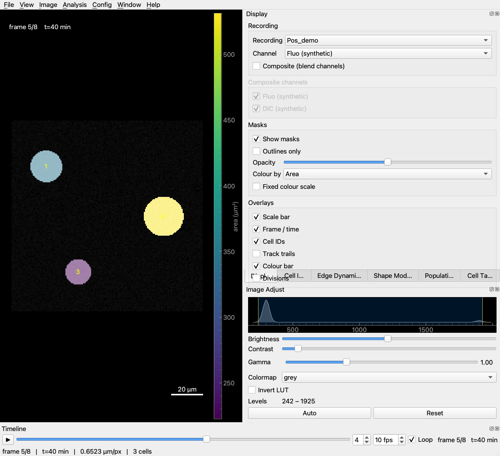
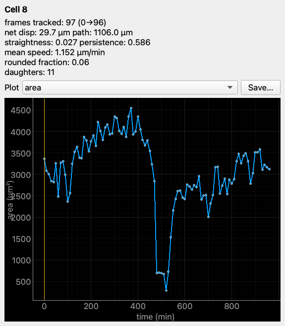
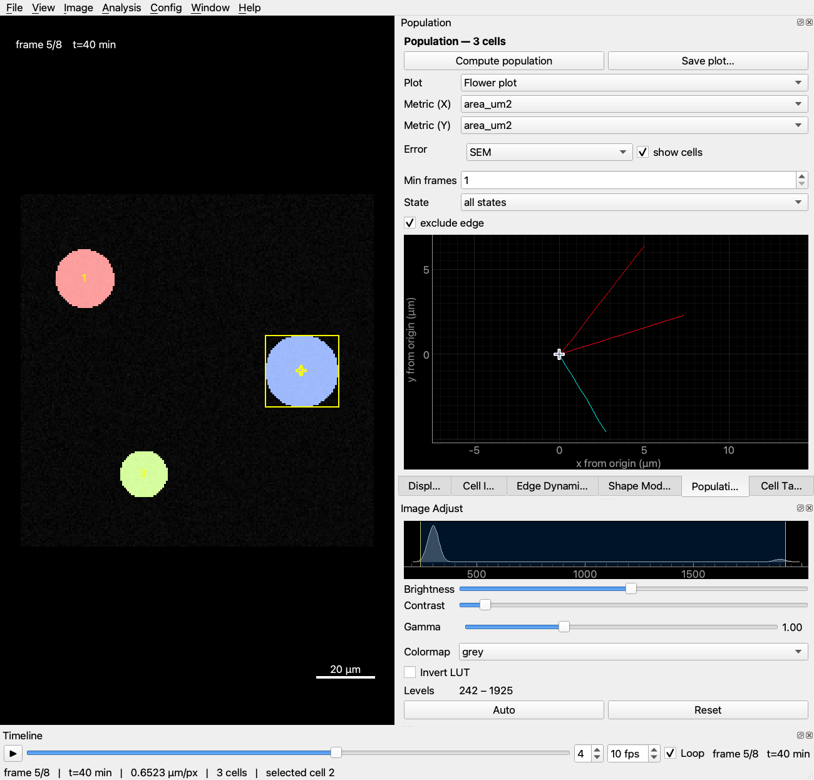
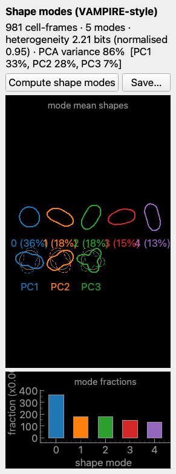
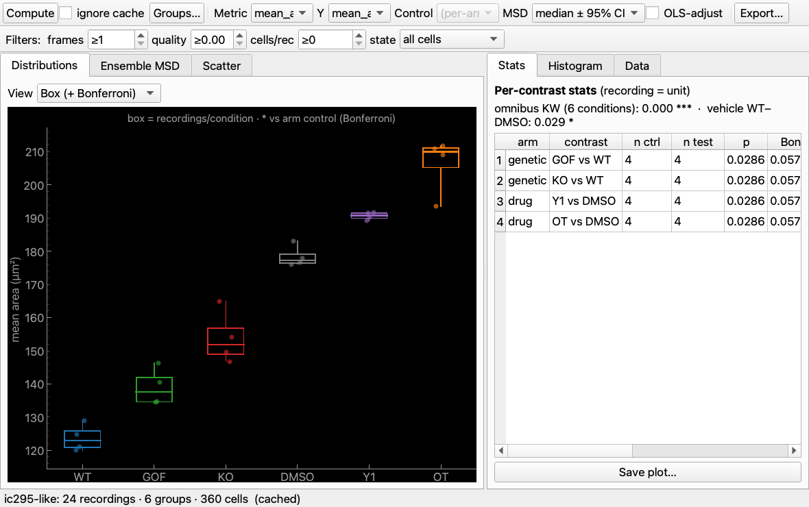
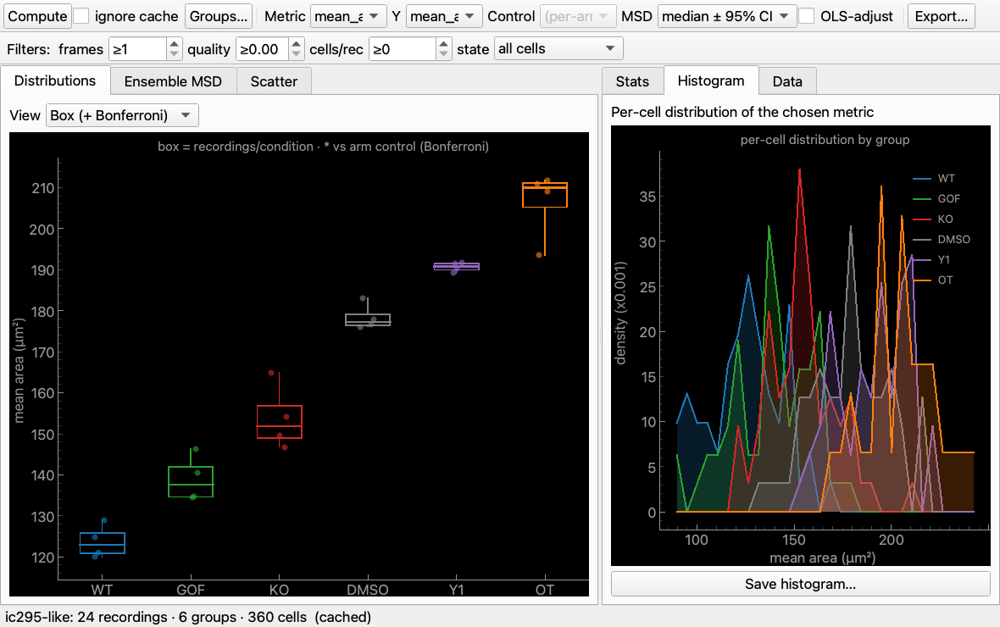
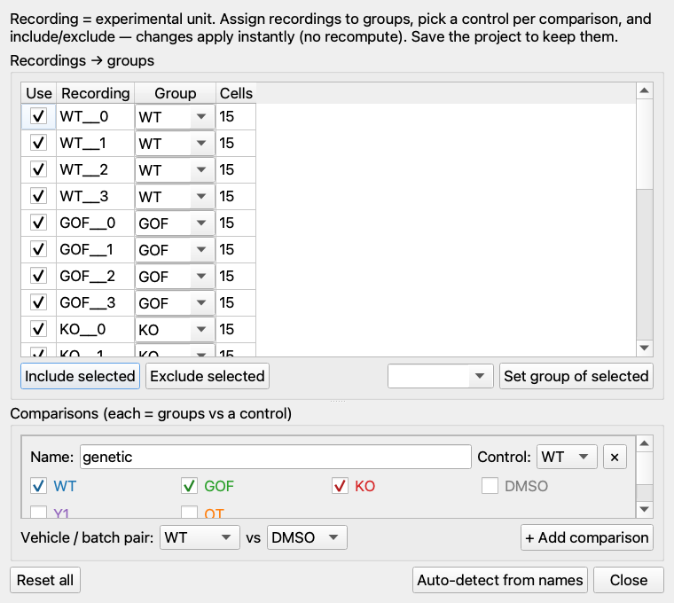

# cellscope_analysis

A **viewer + analysis workbench** for [CellScope](https://github.com/gddickinson/cellscope)
detection results — microscopy recordings (`.ome.tif`) with their
segmentation/tracking masks (`masks.npz`). CellScope *produces and edits* the
masks; this app is the **bench for analysing them**: view recordings with mask
overlays, inspect individual tracked cells, quantify shape / motility / membrane
dynamics, compare all cells in a recording, and export everything as CSV.

CPU-only (no GPU/torch). PyQt5 + pyqtgraph GUI; a pure, GUI-free `maskviewer/analysis`
package does the maths. Built for a **PIEZO1** keratinocyte-migration study
(see `docs/DATA.md`), but general to any CellScope recording.



## Highlights

- **Dockable workbench** — every panel detaches/resizes; layout persists. The
  time bar sits below the view (play/pause, fps, loop).
- **Full image controls** — histogram + draggable levels, brightness/contrast,
  gamma, colormap (LUT), invert, auto; per channel; **composite** multi-channel
  blend (DIC grey + SiR-actin Cy5 magenta).
- **Colour cells by any metric** with a **units colour bar** (area, circularity,
  speed, nearest-neighbour, shape mode, …); per-frame state colouring.
- **Per-cell inspection** — click a cell → metrics + plot of *any* per-frame
  characteristic (shape, perimeter, circularity, convexity, state, speed,
  displacement, turning, IoU, nearest-neighbour, per-channel intensity / membrane
  metrics) + MSD (log/linear, α/D + Fürth persistence-time) + direction
  autocorrelation.
- **Membrane dynamics** — protrusion/retraction **kymograph** + a per-frame edge
  map coloured by edge velocity, with event detection.
- **Shape modes** — VAMPIRE-style clustering (mode shapes, fractions, entropy,
  eigenshapes).
- **Population** — all cells at once: time series, mean ± SEM/SD, histogram,
  scatter, **flower plot**, lineage tree + division timeline; with filtering.
- **Projects** — load any dataset (any treatments / recording counts) via
  **File ▸ Open Project Folder** (auto-derives the experimental *design* — arms,
  controls, vehicle, colours), save/reopen it as a small **project file**, and
  switch between **Recent Projects** without restarting.
- **Comparison window** — a dedicated space (**Analysis ▸ Comparison window**,
  `Ctrl+Shift+C`) for cross-recording / treatment analysis (**recording =
  experimental unit**): tabbed **Distributions** (strip / box+Bonferroni /
  superplot) · **Ensemble MSD** (mean±SEM or median+CI) · **Scatter** (X-vs-Y +
  Spearman), all with **units on the axes**. A **Filters** row (min frames, min
  track-quality, min cells/recording, cell-state) refines the cells/recordings
  used; the right panel is tabbed — **Stats** (per-contrast p / Bonferroni /
  Cohen's d / covariate-adjusted OLS + per-arm KW + vehicle) · **Histogram**
  (per-cell distribution by group) · **Data** (per-recording + per-group tables,
  unit-tagged). Background compute + per-project cache; click a point → load that
  recording in the viewer.
- **Groups & Comparisons editor** (Comparison window ▸ **Groups…**) — assign
  recordings to **groups**, **include/exclude** any recording, define which groups
  form each **comparison** and which is the **control**, and set the vehicle pair.
  Changes apply **instantly** (a remap of the computed table — no recompute) and
  save with the project.
- **Sortable per-cell table**, **CSV export** (per-frame / per-cell / tracks,
  for Origin/Prism), **save any plot** (PNG/SVG), and a **Help ▸ Metrics
  Reference** documenting every metric + tooltips throughout.

| Cell inspection | Population (flower) | Shape modes |
|---|---|---|
|  |  |  |







*(Screenshots use synthetic data only — no real microscopy data is committed.)*

## Environment

```bash
conda env create -f environment.yml      # python, numpy, scipy, pandas, sklearn,
conda activate cellscope_analysis        # tifffile, pyqtgraph, PyQt5, matplotlib, pytest
```

## Quick start

```bash
python scripts/make_sample_data.py        # (optional) write the synthetic sample
python main_viewer.py                      # discovers from config.json, else the sample
python main_viewer.py --data-root /path/to/results/by_condition
python main_viewer.py --recording R.ome.tif --masks R/pipeline_results/masks.npz
```

In the GUI: pick a recording + channel, scrub frames (slider or **←/→**, Space =
play), toggle masks/overlays, set **Colour by** a metric, and click a cell to
inspect it. Heavier analyses (Population, Shape Modes, Cell Table) have a
**Compute** button; these run **off the GUI thread** with a **progress bar + ETA
in the bottom status bar** (the Comparison window shows the same), so the window
stays responsive and you can see how long a pass will take.

## Self-drive (headless remote control)

For automated testing / agent workflows, set `MASKVIEWER_REMOTE=<port>` to expose
a localhost HTTP API that drives the GUI on its own thread:

```bash
MASKVIEWER_REMOTE=8765 python main_viewer.py
curl 'http://127.0.0.1:8765/state'
curl 'http://127.0.0.1:8765/set?recording=0&frame=5&color_by=area'
curl 'http://127.0.0.1:8765/cmd?action=compute_population'
curl 'http://127.0.0.1:8765/screenshot?path=/tmp/v.png&what=window'
```

GUI changes can also be verified headless with `QT_QPA_PLATFORM=offscreen` (see
`SESSION_LOG.md`). File ▸ **Save View Image / Save Window Screenshot** grab PNGs.

## Pointing at your data

Real data is **not** stored in this repo. The quickest way in is **File ▸ Open
Project Folder** — point it at a folder of recording folders and it loads them as
a project, auto-deriving the experimental design (arms / controls / vehicle /
colours) from the condition names. **Save Project As** writes a small JSON you can
reopen (or pick from **Recent Projects**); **Open Project File** loads it back.

For the default launch set, copy the config template and edit:

```bash
cp config.example.json config.json     # gitignored
# "data_roots": [".../cellscope/ic295_analysis/by_condition"]
```

Each root is scanned for recording folders (`*.ome.tif` + `pipeline_results/masks.npz`);
the immediate sub-folder name is used as the **condition**. The bundled synthetic
`sample_data/` is always available as a fallback.

## Data formats

| | format |
|---|---|
| Recording | `*.ome.tif`, `(T, C, H, W)` uint16 + `*.ome.json` (`um_per_px`, `time_interval_min`, `channel_names`) |
| Masks | `masks.npz`, key `labels`, `(T, H, W)` int32 — `0`=bg, positive IDs track-consistent |
| Divisions | `pipeline_results/divisions.json` (optional) — parent→daughter events |

**What the data is + how masks were made** — see [`docs/DATA.md`](docs/DATA.md).

## Analysis package

Pure, GUI-free, testable functions in `maskviewer/analysis/` — morphometry
(`cell_metrics`), motion (`motion`), state (`state`), nearest-neighbour
(`neighbors`), edge dynamics (`edge_dynamics`), shape modes (`shape_modes`),
membrane quality (`membrane`), population (`population`), lineage (`lineage`),
CSV export (`exporters`), and metric docs (`metric_docs`). See **INTERFACE.md**
for the full map.

## Tests

```bash
python -m pytest -q       # in the cellscope_analysis env
```

## License

MIT (see LICENSE).
